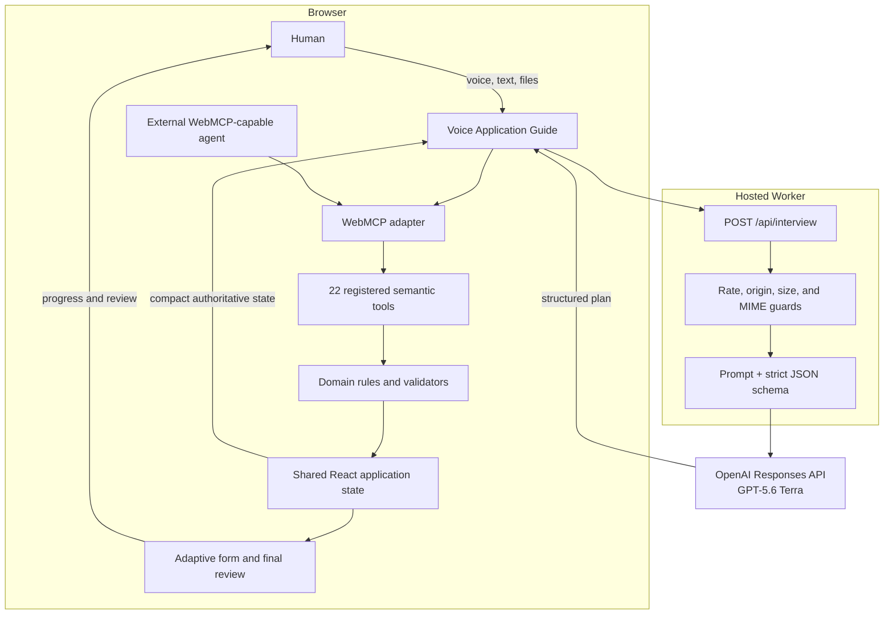
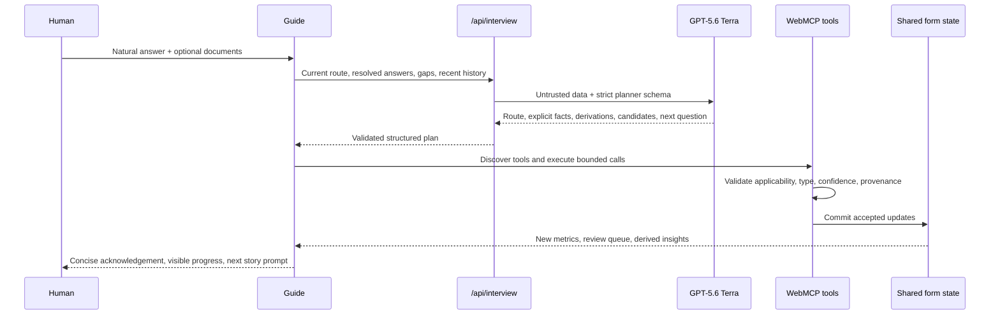

# VisaFlow Architecture

This document explains how VisaFlow combines an LLM planner, WebMCP semantic tools, deterministic application rules, and human review. It is supplementary evidence for reviewers; the WebMCP Challenge does not explicitly require a separate architecture file.

## Design goals

1. **Make the website authoritative.** The LLM may interpret language, but it cannot bypass application routing or validation.
2. **Make WebMCP essential.** Agents act through discoverable, typed website capabilities rather than DOM knowledge or click automation.
3. **Minimize conversational turns.** Each story-shaped prompt targets several compatible gaps and extracts all supported facts, not only the requested ones.
4. **Keep uncertainty visible.** Explicit facts, document facts, deterministic derivations, and reviewable proposals remain distinguishable.
5. **Keep the human in control.** Sensitive or uncertain values enter one editable attention queue, and only the person can finish the fictional application.

## System context



## Why an LLM alone is insufficient

An LLM can extract a possible JSON object from a conversation, but it does not inherently know the application's current conditional path, which values are already resolved, which choices are legal, or whether a write should trigger human review. Hard-coding the entire page contract into a chatbot would duplicate website logic and become stale whenever the form changes.

WebMCP reverses that dependency. The page publishes its current capabilities as typed tools. The agent discovers those tools at runtime, invokes them by semantic name, and receives structured success or validation errors. The website owns the contract and can evolve independently of the agent.

## Component boundaries

| Component | Responsibility | Key files |
| --- | --- | --- |
| Application domain | Questions, sections, routing, applicability, metrics, conflicts, reducer | `src/data/questions.ts`, `src/agent/applicationFlow.ts`, `src/state/applicationState.ts` |
| LLM planner client | Builds compact state packets, preserves recent conversation and partial facts, prevents repeated questions | `src/agent/interview.ts`, `src/components/AdaptiveAssistant.tsx` |
| Hosted planner endpoint | Validates requests, calls the Responses API with strict structured output, returns a plan without writing state | `scripts/create-worker.mjs` |
| WebMCP registry | Defines 22 tool names, descriptions, schemas, annotations, handlers, and domain validation | `src/webmcp/tools.ts` |
| WebMCP lifecycle | Registers tools, discovers them, invokes native `executeTool`, and connects commits to React state | `src/webmcp/WebMcpContext.tsx` |
| Execution batching | Converts extracted facts and proposals into bounded semantic calls | `src/agent/webMcpBatches.ts` |
| Human interface | Voice/text conversation, document attachment, progress narration, final queue, finish action | `src/components/AdaptiveAssistant.tsx`, `src/components/ApplicationWorkspace.tsx` |

## One interview turn



### Planner output categories

- **Updates:** complete facts directly stated by the person or extracted from an attached document.
- **Derived updates:** values unambiguously entailed or deterministically calculated from explicit facts.
- **Candidates:** useful normalizations or interpretations with lower confidence; written now but visibly flagged for final review.
- **Partial facts:** useful fragments that cannot yet form a safe value and must survive into a later turn.
- **Question focus:** up to five compatible gaps used to construct one natural story prompt.

The model never writes application state. The UI translates its plan into WebMCP calls, and tool handlers decide what is accepted.

## The semantic tool surface

### Route reasoning

- `inspect_application_flows`
- `select_application_flow`
- `get_next_best_question`
- `simulate_flow_change`

### State inspection

- `get_application_status`
- `get_section_requirements`
- `list_unanswered_questions`
- `get_conflicts`
- `get_approved_profile_facts`

### Validated domain writes

- `provide_identity_information`
- `provide_passport_information`
- `provide_contact_information`
- `provide_address_history`
- `provide_employment_history`
- `provide_education_information`
- `provide_travel_information`
- `provide_family_information`
- `provide_interview_answers`

### Evidence and review

- `confirm_sensitive_answers`
- `attach_evidence`
- `derive_application_insights`
- `request_review`

The broad `provide_interview_answers` tool exists for efficient multi-fact conversational turns, but it is not an escape hatch. Its handler enforces the same question IDs, route applicability, types, option lists, date formats, confidence thresholds, source labels, and review flags as the section-level tools.

## Trust and provenance model

| Source | Example | Immediate behavior |
| --- | --- | --- |
| User statement | “I work at ABC as a software engineer.” | Fill with explicit evidence and normal validation |
| Document | Employer letter with start date and salary | Fill as document-sourced and add to final review |
| Deterministic derivation | Departure minus arrival gives six days | Display with source fields and explanation |
| Terra proposal | Panvel likely maps to Maharashtra, India | Fill as reviewable; never present as verified |
| Sensitive value | National identifier or visa-refusal answer | Require explicit human confirmation |

Tool responses include structured application status, applied or skipped fields, and validation errors. The activity stream makes the resulting semantic actions visible to both the user and a judge.

## Conditional routing

The base application contains 55 questions. A selected route is the product of:

- purpose: tourism, business, or family visit;
- funding: self, employer, host, or mixed; and
- travel history: first-time or returning visitor.

`select_application_flow` computes the applicable question set and excluded IDs. Every later write is checked against that set. The agent therefore cannot fill a field that the selected route makes irrelevant, and a route change can be simulated before committing it.

## Review and completion

The application is ready to finish only when:

```text
missing applicable fields = 0
pending confirmations     = 0
unresolved conflicts      = 0
```

The guide consolidates reviewable values instead of interrupting the interview for each uncertainty. The human can correct any proposal, approve the queue once, and then use **Finish & submit**. That action creates only a local fictional receipt; there is no government submission integration.

## Security and operational controls

- `OPENAI_API_KEY` is read only by the hosted Worker.
- The planner endpoint permits same-origin requests and rejects other methods.
- Each IP is limited to 24 planning requests per ten-minute window.
- A turn accepts at most six files, 4 MB each and 6 MB total.
- PDFs, text, JPEG, PNG, and WebP are the only accepted document types.
- The request body is bounded and the upstream call has a timeout.
- All user strings and document contents are explicitly treated as untrusted data.
- OpenAI requests set `store: false`.
- Browser-local state can be cleared with **Start over**.

## Testing strategy

The Vitest suite verifies behavior at the domain, semantic-tool, and integrated UI levels:

- conditional flow selection and simulation;
- state metrics, validation, and reducer behavior;
- registration of all 22 tools and cleanup of their lifecycle;
- native tool execution updating the visible React form;
- conversational route selection and multi-fact batching;
- safe application of document-extracted facts;
- sensitive/review gating and correction batches;
- final completion receipt behavior; and
- multilingual rendering.

Run the evidence locally with:

```bash
npm test
npm run build
```

## Deployment

The Vite build is transformed into a Cloudflare Workers-compatible artifact:

```text
dist/client/          static React application
dist/server/index.js  Worker: assets + /api/interview
```

The production deployment uses ChatGPT Sites. `OPENAI_API_KEY` is configured as a hosted secret, so the browser bundle and public repository never contain it.
