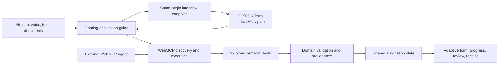

# VisaFlow: The Adaptive WebMCP Agent

VisaFlow turns a deliberately long, conditional visitor-visa application into a guided voice or text conversation. A human tells their story naturally; an LLM extracts stated facts, proposes reasonable interpretations, and chooses the next high-value question; WebMCP lets the agent discover the website's real capabilities, select the applicable path, and update the live form through validated semantic tools.

[Try the live application](https://adaptive-visitor-visa-webmcp.avszoom.chatgpt.site/) · [Read the architecture](ARCHITECTURE.md) · [MIT License](LICENSE)

> [!IMPORTANT]
> VisaFlow is a fictional hackathon demonstration. It is not affiliated with the U.S. government, does not provide immigration advice, and does not submit a real visa application. The included documents and identities are synthetic.

## The problem

Long government forms force people to translate a life story into an unfamiliar sequence of fields. Conditional branches make that worse: applicants answer questions that may not apply, repeat information across sections, and often discover missing evidence only at the end. A generic chatbot can discuss the form, but without a semantic contract it must know the page implementation in advance or manipulate fragile DOM selectors.

## Why WebMCP is the right fit

The person knows their story. The website knows its rules, valid choices, dependencies, and safety constraints. WebMCP gives an agent a live, typed contract between the two.

With VisaFlow, an agent can:

- discover 22 application-specific tools directly from the page;
- inspect possible routes before writing data;
- select a family, tourism, or business path and immediately remove irrelevant questions;
- apply many facts from one natural answer or supporting document without clicking through sections;
- ask the website for the next best question based on current shared state;
- calculate transparent derived values while preserving their source fields;
- surface uncertain interpretations in one editable final-review queue; and
- request review only after the website confirms that required fields, evidence, conflicts, and confirmations are resolved.

This is more than LLM autofill. The model proposes a plan, but the website remains authoritative: every write is checked for field applicability, type, allowed choices, date ranges, confidence, provenance, and review requirements before it reaches the form.

## What the human and agent do together

| Human | Agent | Website through WebMCP |
| --- | --- | --- |
| Describes the trip and life context naturally | Extracts every supported fact from each answer | Selects the valid application path and removes irrelevant questions |
| Speaks, types, or attaches supporting documents | Chooses a story-shaped follow-up covering several related gaps | Validates and applies structured updates to shared application state |
| Reviews uncertain or sensitive values once | Separates explicit facts, safe derivations, and reviewable proposals | Preserves provenance, exposes conflicts, and calculates readiness |
| Makes the final decision to finish | Explains progress and every semantic action | Enables completion only when the applicable form is ready |

The result is a cooperative loop: the human supplies meaning, the agent connects it, and the website enforces truth and policy.

## Judge-ready demo

1. Open the [live app](https://adaptive-visitor-visa-webmcp.avszoom.chatgpt.site/) in ChatGPT's in-app browser or a Chrome build with WebMCP enabled.
2. Choose voice or text and answer the first prompt with a short trip story, for example:

   > I live in Panvel, India and work as a software engineer at ABC. I am visiting my brother in New York from October 4 to October 10, 2026, staying with him, and paying for the trip myself.

3. Watch VisaFlow choose **Family visit → Self-funded**, remove non-applicable questions, fill several verified fields, and clearly separate derived or proposed values.
4. Attach one or more synthetic documents from [`public/demo-documents`](public/demo-documents) to show document-assisted extraction.
5. Open **Agent decisions & WebMCP actions** to inspect the semantic operations and live progress.
6. Answer the remaining bundled story prompts, edit the consolidated attention queue, and approve it once.
7. Click **Finish & submit** to show the fictional completion receipt and confirmation number.
8. Use **Start over** to reset the browser-local application for another demo.

## Product capabilities

- A 55-question, government-style application across identity, passport, contact, address, employment, education, travel, family, evidence, and review sections
- Adaptive routes for tourism, business, and family visits, with funding and prior-travel branches
- GPT-5.6 Terra planning with strict structured output and compact conversation memory
- Story-shaped prompts that target up to five related gaps per turn
- Voice input, spoken questions, typed answers, and six-document PDF/image upload support
- Immediate form updates with visible counts for completed, remaining, review, and evidence items
- Explicit provenance for user statements, document facts, deterministic derivations, and Terra proposals
- A consolidated human-review queue instead of repeated confirmation turns
- English, Spanish, French, and Hindi interfaces
- A gated finish action with a fictional receipt only after applicable fields and reviews are complete

## WebMCP implementation

On mount, the application creates the tool definitions from the current domain model and registers each one with the browser-provided `document.modelContext`:

```ts
const tools = createVisaApplicationTools(runtime)

for (const tool of tools) {
  await document.modelContext.registerTool(tool, { signal: controller.signal })
}
```

The embedded guide uses the same discover-and-execute surface as an external agent when native WebMCP is available:

```ts
const registeredTools = await document.modelContext.getTools()
const tool = registeredTools.find((candidate) => candidate.name === call.toolName)
await document.modelContext.executeTool(tool, JSON.stringify(call.input))
```

The 22 tools are grouped by responsibility:

| Capability | Tools |
| --- | --- |
| Route reasoning | `inspect_application_flows`, `select_application_flow`, `get_next_best_question`, `simulate_flow_change` |
| State inspection | `get_application_status`, `get_section_requirements`, `list_unanswered_questions`, `get_conflicts`, `get_approved_profile_facts` |
| Validated writes | `provide_identity_information`, `provide_passport_information`, `provide_contact_information`, `provide_address_history`, `provide_employment_history`, `provide_education_information`, `provide_travel_information`, `provide_family_information`, `provide_interview_answers` |
| Evidence and review | `confirm_sensitive_answers`, `attach_evidence`, `derive_application_insights`, `request_review` |

All definitions, JSON schemas, annotations, validation, and execution handlers are in [`src/webmcp/tools.ts`](src/webmcp/tools.ts). Registration and execution lifecycle code is in [`src/webmcp/WebMcpContext.tsx`](src/webmcp/WebMcpContext.tsx).

## Architecture at a glance



See [`ARCHITECTURE.md`](ARCHITECTURE.md) for component boundaries, the turn lifecycle, trust model, and deployment design.

## Trust, privacy, and failure boundaries

- `OPENAI_API_KEY` exists only as a hosted server secret and is never shipped to browser code.
- The interview endpoint accepts same-origin requests, applies per-IP rate limits, caps request and document sizes, and allows only supported MIME types.
- Attached files are treated as untrusted evidence, never as instructions.
- The Responses API request uses `store: false`.
- High-risk facts such as names, identifiers, dates of birth, refusals, and declarations are never invented.
- Reasonable low-risk interpretations may be filled immediately only as visibly reviewable proposals.
- Draft state is stored in the user's browser; **Start over** clears it.
- The embedded completion receipt is explicitly fictional and does not call a government system.

## Run locally

### Prerequisites

- A current Node.js and npm installation
- A WebMCP-capable browser to exercise native tool registration
- An OpenAI API key only if deploying the server-side interview endpoint

### Browser application

```bash
git clone https://github.com/avszoom/webmcp.git
cd webmcp
npm install
npm run dev
```

The local Vite server runs the interface and WebMCP tool layer. The full LLM interview is available on the hosted application; when deploying your own copy, configure `OPENAI_API_KEY` as a server-side secret. Never prefix it with `VITE_` or commit it.

### Production build

```bash
npm run build
```

The build produces a Cloudflare Workers-compatible application in `dist/`, including the static client and the same-origin `/api/interview` Worker entrypoint.

## Verification

```bash
npm test
npm run build
```

The current suite contains 32 tests across five files. It covers route selection and simulation, application-state transitions, registration of all 22 semantic tools, native WebMCP writes updating the visible form, LLM-plan batching, document extraction application, review gating, the completion receipt, and multilingual rendering.

## Repository map

```text
src/agent/                 LLM request memory, route logic, derivations, batching
src/components/            Government form and floating conversational guide
src/data/                  Application sections, questions, and synthetic profile
src/state/                 Shared application state, metrics, persistence, reducer
src/webmcp/                Tool registry, schemas, handlers, registration, execution
scripts/create-worker.mjs  Same-origin LLM endpoint and strict response schema
public/demo-documents/     Synthetic evidence files for the demonstration
ARCHITECTURE.md            Detailed system and trust architecture
```

## Built with

WebMCP · React 19 · TypeScript · Vite · OpenAI Responses API · GPT-5.6 Terra · Web Speech APIs · ChatGPT Sites

## License

Released under the [MIT License](LICENSE).
